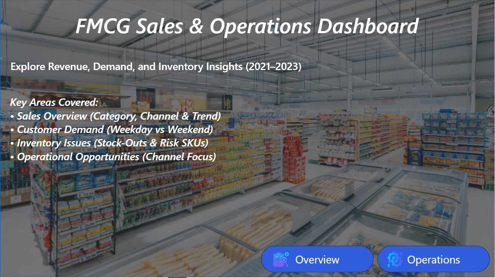
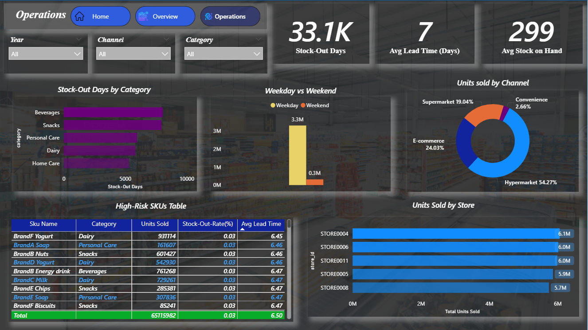

# Anudip_Project
# FMCG Sales & Operations Dashboard (Power BI)

## 📊 Project Overview
This project is an end-to-end Power BI dashboard built to analyze **sales performance, customer demand, and inventory operations** for an FMCG business from **2021 to 2023**.

The dashboard helps business teams understand:
- Revenue trends over time
- Category and channel performance
- Stock-out risks and operational bottlenecks
- Demand behavior across weekdays and weekends

It is designed with a **management and operations decision-making perspective**.

---

## 🧠 Business Objectives
- Track overall revenue and unit sales growth
- Identify top-performing and underperforming product categories
- Analyze sales contribution by channel (Hypermarket, E-commerce, etc.)
- Monitor stock-out rates and high-risk SKUs
- Understand demand patterns (Weekday vs Weekend)
- Support inventory and supply chain planning

---

## 📂 Dataset Information
- **Source**: Kaggle (Public Dataset)
- **Domain**: FMCG Retail Sales & Inventory
- **Time Period**: 2021 – 2023
- **Data Coverage**:
  - Monthly sales transactions
  - Product categories and SKUs
  - Store and channel-level sales
  - Inventory metrics (stock-outs, lead time)

Dataset is available in the `data/` folder.

---

## 📈 Dashboard Pages

### 🏠 Landing Page
Provides a high-level introduction and navigation to key dashboard sections.

---

### 📊 Sales Overview
Focuses on revenue and demand analysis.

**Key KPIs:**
- Total Net Sales
- Total Units Sold
- Average Revenue per Unit
- Stock-Out Rate

**Key Visuals:**
- Monthly Net Sales Trend
- Sales by Category
- Sales by Channel
- Units Sold by Category

---

### ⚙️ Operations Dashboard
Focused on inventory health and operational efficiency.

**Key Metrics:**
- Total Stock-Out Days
- Average Lead Time
- Average Stock on Hand

**Key Visuals:**
- Stock-Out Days by Category
- Weekday vs Weekend Demand
- Units Sold by Channel
- High-Risk SKU Table
- Top Stores by Units Sold

---

## 🛠 Tools & Technologies Used
- **Power BI** – Data modeling, DAX, and dashboard development
- **Excel** – Data storage and preprocessing
- **DAX** – KPI calculations and operational metrics

---

## 📌 Key Insights
- Hypermarkets contribute the highest share of total sales
- Snacks and Beverages drive the majority of revenue
- Weekday demand is significantly higher than weekend demand
- Certain SKUs show consistent stock-out risk due to longer lead times
- Inventory optimization opportunities exist in high-volume categories

---

## 🚀 How to Use
1. Download the `FMCG_Dashboard.pbix` file
2. Open it using **Power BI Desktop**
3. Interact with slicers for Year, Category, and Channel
4. Explore insights across Overview and Operations pages

If you find this project useful or insightful, feel free to ⭐ the repository.
